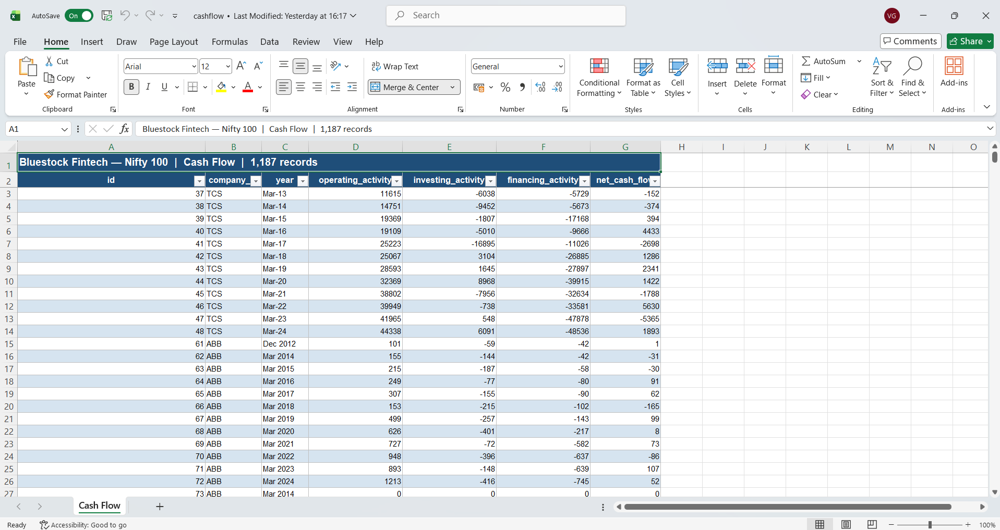

# Dataset Notes

## companies.xlsx

- Location: data/raw/companies.xlsx
- Header row: Row 2, loaded using header=1
- Records loaded: 92
- Primary Key: id
- Purpose: Master company reference table

### Columns
- id
- company_logo
- company_name
- chart_link
- about_company
- website
- nse_profile
- bse_profile
- face_value
- book_value
- roce_percentage
- roe_percentage

### Notes
- The first row contains metadata.
- Actual column headers start from the second row.
- Company id should be normalized using uppercase and stripped whitespace.

## profitandloss.xlsx

- Location: data/raw/profitandloss.xlsx
- Header row: Row 2, loaded using header=1
- Records: 1276
- Primary Key: (company, year)

### Important Columns
- id
- company
- year
- sales
- expenses
- operating_profit
- opm_percentage
- other_income
- interest
- depreciation
- profit_before_tax
- tax_percentage
- net_profit
- eps

### Notes
- Contains yearly profit and loss information.
- Year values include formats such as:
  - Mar 2024
  - Mar 2023
  - Dec 2012
  - TTM

  ## balancesheet.xlsx

- Location: data/raw/balancesheet.xlsx
- Header row: Row 2, loaded using header=1
- Records: 1312
- Primary Key: (company, year)

### Important Columns
- id
- company
- year
- equity_capital
- reserves
- borrowings
- other_liabilities
- total_liabilities
- fixed_assets
- cwip
- investments
- other_assets
- total_assets

### Notes
- Contains yearly balance sheet information.
- Year values include formats such as:
  - Mar 2024
  - Mar 2023
  - Dec 2012
  - Sep 2024
- total_assets should generally match total_liabilities.
- Will be used later for Balance Sheet validation checks.

## analysis.xlsx

- Location: data/raw/analysis.xlsx
- Header row: Row 2, loaded using header=1
- Records: 20
- Primary Key: id

### Important Columns
- id
- company
- compounded_sales_growth
- compounded_profit_growth
- stock_price_cagr
- roe

### Notes
- Contains growth and performance metrics.
- Data includes multiple periods:
  - 10 Years
  - 5 Years
  - 3 Years
  - TTM
  - Last Year
  - 1 Year
- Values are stored as percentages.
- Used for company growth and performance analysis.

## documents.xlsx

- Location: data/raw/documents.xlsx
- Header row: Row 2, loaded using header=1
- Records: 1585
- Primary Key: (company, year)

### Important Columns
- id
- company
- year
- annual_report

### Notes
- Contains annual report links for companies.
- Annual reports are stored as PDF URLs.
- Year values are numeric (2024, 2023, 2022, etc.).
- Multiple years of reports are available for each company.
- Will be used later for document management and report retrieval.

## prosandcons.xlsx

- Location: data/raw/prosandcons.xlsx
- Header row: Row 2, loaded using header=1
- Records: 16
- Primary Key: id

### Columns
- id
- company_id
- pros
- cons

### Notes
- Contains qualitative company strengths and weaknesses.
- Multiple rows may exist for the same company.
- Some pros values are NULL.
- Some cons values are NULL.
- company_id should match companies.xlsx company ids.

## sectors.xlsx

- Location: data/raw/sectors.xlsx
- Header row: Row 1
- Records: 92
- Primary Key: id

### Columns
- id
- company_id
- broad_sector
- sub_sector
- index_weight
- market_cap_category

### Notes
- Maps each company to its sector classification.
- One row per company.
- company_id should match companies.xlsx company ids.
- index_weight is numeric.
- market_cap_category contains values such as Large Cap.

## financial_ratios.xlsx

- Location: data/raw/financial_ratios.xlsx
- Header row: Row 1
- Records: Approximately 1300+
- Primary Key: (company_id, year)

### Columns
- id
- company_id
- year
- net_profit_margin
- operating_profit_margin
- return_on_equity
- debt_to_equity
- interest_coverage
- asset_turnover
- free_cash_flow
- capex
- earnings_per_share
- book_value_per_share
- dividend_payout_ratio
- total_debt
- cash_from_operations

### Notes
- Contains calculated financial ratios and metrics.
- One company can have multiple years of records.
- company_id should match companies.xlsx company ids.
- year contains values such as Dec 2012, Mar 2014, Mar 2024.
- Useful for KPI engine and health score calculations.

## peer_groups.xlsx

- Location: data/raw/peer_groups.xlsx
- Header row: Row 1
- Records: Approximately 50+
- Primary Key: id

### Columns
- id
- peer_group
- company_id
- is_benchmark

### Notes
- Groups companies into peer comparison categories.
- company_id should match companies.xlsx company ids.
- is_benchmark contains TRUE or FALSE values.
- Each peer group has one benchmark company.
- Used for peer comparison and ranking features.

## market_cap.xlsx

- Location: data/raw/market_cap.xlsx
- Header row: Row 1
- Records: Multiple years per company
- Primary Key: (company_id, year)

### Columns
- id
- company_id
- year
- market_cap
- enterprise_value
- pe_ratio
- pb_ratio
- ev_ebitda
- dividend_yield_pct

### Notes
- Contains valuation and market capitalization metrics.
- company_id should match companies.xlsx company ids.
- One company can have multiple yearly records.
- Used for valuation analysis and stock screening.
- year values range from 2019 to 2024.

## stock_prices.xlsx

- Location: data/raw/stock_prices.xlsx
- Header row: Row 1
- Records: Approximately 5520
- Primary Key: (company_id, date)

### Columns
- id
- company_id
- date
- open_price
- high_price
- low_price
- close_price
- volume
- adjusted_close

### Notes
- Contains historical stock price data.
- company_id should match companies.xlsx company ids.
- date is in YYYY-MM-DD format.
- Used for price trend analysis and CAGR calculations.
- adjusted_close is used for return calculations.
- volume contains traded share volume.